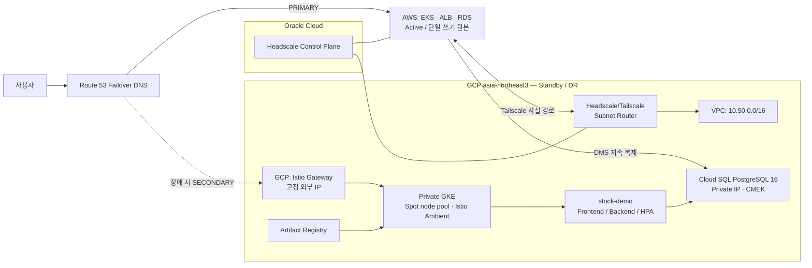

# 금융권 멀티클라우드 통합 관제 플랫폼 — GCP DR

AWS를 활성(Primary) 환경으로, GCP를 대기(Standby) 환경으로 운영하기 위한 재해 복구(Disaster Recovery, DR) 인프라 및 GKE 배포 저장소입니다. 장애 시 Cloud SQL을 승격하고 GKE 서비스로 트래픽을 전환하며, 복구 후에는 AWS를 다시 단일 쓰기 원본으로 되돌리는 절차를 제공합니다.

> 이 저장소는 운영 인프라를 변경할 수 있습니다. `terraform apply`, DB 승격, Route 53 전환은 반드시 운영 승인 및 사전 점검 후 실행해 주세요.

## 프로젝트 개요

이 프로젝트는 다음 기능을 코드와 운영 문서로 관리합니다.

- 서울 리전(`asia-northeast3`)의 VPC, 서브넷, Cloud NAT, 방화벽, IAP SSH 접근
- Private GKE와 Spot 노드 풀, Cluster Autoscaler, Istio Ambient Mesh 및 Argo CD
- AWS RDS PostgreSQL에서 GCP Cloud SQL PostgreSQL로의 DMS 지속 복제
- OCI Headscale 제어 평면과 Tailscale 서브넷 라우터를 통한 AWS ↔ GCP 사설 통신
- Artifact Registry의 DR 이미지 저장소, `stock-demo` 애플리케이션과 HPA
- Route 53 PRIMARY/SECONDARY 헬스 체크 기반의 AWS → GCP 트래픽 전환
- KMS(CMEK), Secret Manager, Cloud Armor, 감사 로그를 포함한 보안 구성

### 디렉터리 구성

| 경로 | 내용 |
| --- | --- |
| `infra/Ecc` | 네트워크, VPN 라우터, Cloud SQL, DMS 기반, 보안, Artifact Registry, 고정 Gateway IP |
| `infra/GKE` | Private GKE, Spot 노드 풀, Workload Identity, Istio, Argo CD |
| `k8s/stock-demo` | DR용 frontend/backend, Gateway, HPA의 Kustomize 매니페스트 |
| `k8s/*.yaml` | 기본 예제 애플리케이션 및 Workload Identity 매니페스트 |
| `scripts/dr` | DB 장애 조치·복귀 전 사전 점검 및 상태 확인 스크립트 |
| `*_RUNBOOK.md`, `DR_*.md` | DB 동기화, Route 53, 장애 조치 및 복귀 운영 절차 |
| `*.drawio` | 상세 인프라/역할/멀티클라우드 아키텍처 원본 |

## 아키텍처 다이어그램



정확한 리소스 배치와 역할은 [GCP 인프라 다이어그램](GCP_Infrastructure_Architecture.drawio), [AWS-GCP DR 다이어그램](GCP_AWS_DR_Architecture.drawio), [DR 역할 다이어그램](GCP_DR_Role_Architecture.drawio)에서 확인할 수 있습니다.

### 전환 원칙

1. 평상시 AWS만 쓰기를 수행하고 GCP Cloud SQL은 DMS 복제 대기 상태로 유지합니다.
2. 장애 조치 전 AWS 쓰기를 차단하고 복제 지연을 확인한 뒤 Cloud SQL을 승격합니다.
3. 승격 후에만 GKE 애플리케이션의 DB 접근/쓰기와 Route 53 GCP 전환을 허용합니다.
4. AWS와 GCP에 동시에 쓰기를 허용하지 않습니다. 복귀 시에는 별도 논리 복제로 AWS를 동기화합니다.

세부 절차는 [DB 동기화 런북](DB_SYNC_RUNBOOK.md), [DB 장애 조치 자동화](DB_FAILOVER_AUTOMATION.md), [DR 워크플로](DR_WORKFLOWS.md)를 따릅니다.

## 사용 기술 스택 및 버전

| 영역 | 기술 | 저장소에서 관리하는 버전/설정 |
| --- | --- | --- |
| IaC | Terraform, Google Provider | Google `~> 5.0` (`infra/Ecc`), Google `~> 7.31` (`infra/GKE`) |
| Kubernetes IaC | Helm, Kubernetes Provider | Helm `~> 2.12`, Kubernetes `~> 2.24` |
| 컨테이너 플랫폼 | GKE | Private node, VPC-native, Advanced Datapath(Cilium), Workload Identity |
| 서비스 메시 | Istio | Ambient profile, Gateway API `v1.1.0` CRD |
| 데이터베이스 | Cloud SQL for PostgreSQL | PostgreSQL 16, Private IP, CMEK, logical decoding |
| 데이터 마이그레이션 | GCP Database Migration Service | AWS PostgreSQL → Cloud SQL 지속 복제(선택 활성화) |
| 네트워크 | VPC / Cloud NAT / Cloud Router / Tailscale / Headscale | GCP 서울 리전, Tailscale UDP `41641` |
| 이미지 저장소 | Artifact Registry | Docker 저장소 `dr-app` |
| 배포/확장 | Kustomize, HPA, GKE Cluster Autoscaler | API `autoscaling/v2`, Pod CPU 목표 70% |
| 보안 | Cloud KMS, Secret Manager, Cloud Armor, IAP | KMS 키 90일 회전, Cloud SQL 공인 IP 비활성화 |

CLI 도구(`gcloud`, `kubectl`, Terraform)의 실행 버전은 이 저장소에서 고정하지 않습니다. 운영 환경에서는 조직 표준 버전을 사용하고, 배포 전 `terraform providers` 및 `kubectl version --client`로 호환성을 확인해 주세요.

## 실행 및 배포 방법

### 1. 사전 준비

- GCP 프로젝트에 인증된 `gcloud` 계정과 필요한 IAM 권한을 준비합니다.
- Terraform 상태 버킷 `ilpoomjinro-tfstate-0430`에 접근할 수 있어야 합니다.
- `infra/Ecc` 적용 전 Headscale pre-auth key와 AWS 서브넷 라우터 정보가 필요합니다.
- GKE 배포 전 AWS ECR 이미지가 준비되어 있고, Artifact Registry에 이미지를 미러링할 권한이 필요합니다.

```bash
gcloud auth application-default login
gcloud config set project ilpoomjinro
terraform version
kubectl version --client
```

### 2. 기반 인프라 배포

기반 인프라는 GKE보다 먼저 적용합니다. 기존 원격 상태와 실제 리소스에 영향을 주므로 `plan` 결과를 검토한 후에만 적용해 주세요.

```bash
cd infra/Ecc
terraform init
terraform fmt -check
terraform validate
terraform plan
terraform apply
```

### 3. GKE 및 플랫폼 구성 배포

`infra/GKE`는 `vpc-gcp-prd`, `subnet-was-gke`, `gke-app-sa`가 이미 존재한다고 가정합니다. 위 기반 인프라를 적용한 뒤 실행합니다. 적용 과정에서 Gateway API, Istio Ambient 구성요소, Argo CD가 설치됩니다.

```bash
cd infra/GKE
terraform init
terraform fmt -check
terraform validate
terraform plan
terraform apply

gcloud container clusters get-credentials gke-prd-cluster \
  --zone asia-northeast3-a \
  --project ilpoomjinro
kubectl get nodes
```

### 4. DR 애플리케이션 배포

먼저 `k8s/stock-demo/kustomization.yaml`의 이미지 태그가 배포할 Artifact Registry 이미지와 일치하는지 확인합니다. DB Secret을 생성한 뒤 Kustomize를 적용합니다.

```bash
kubectl create namespace stock-demo --dry-run=client -o yaml | kubectl apply -f -

kubectl -n stock-demo create secret generic stock-api-db \
  --from-literal=DB_HOST="$GCP_DR_DB_HOST" \
  --from-literal=DB_USER="$GCP_DR_DB_USER" \
  --from-literal=DB_PASSWORD="$GCP_DR_DB_PASSWORD" \
  --dry-run=client -o yaml | kubectl apply -f -

kubectl apply -k k8s/stock-demo
kubectl -n stock-demo rollout status deployment/stock-api
kubectl -n stock-demo rollout status deployment/stock-web
kubectl -n stock-demo get gateway,httproute,hpa,pods
```

대기 상태의 GCP DB에는 애플리케이션 쓰기를 허용하면 안 됩니다. 실제 DR 전환 시에는 [GKE DR 서비스 배포 가이드](GKE_DR_SERVICE_DEPLOYMENT.md)와 [GKE 자동 확장 가이드](GKE_AUTOSCALING.md)를 함께 따르세요.

### 5. 장애 조치 및 복귀

아래 스크립트는 운영 확인/사전 점검을 돕습니다. `--execute`가 포함된 DB 승격 명령은 승인된 장애 조치에서만 사용해야 합니다.

```bash
scripts/dr/status.sh
scripts/dr/failover-to-gcp.sh
scripts/dr/failback-preflight.sh
```

Route 53 전환과 TLS/Gateway 고정 IP 설정은 [Route 53 DR 전환 가이드](ROUTE53_DR_FAILOVER.md)를 따르세요.

## 환경 변수 설정 방법

민감한 값은 Git에 기록하지 않습니다. 로컬 Terraform 실행에는 `terraform.tfvars` 외부 파일 또는 `TF_VAR_` 환경 변수를 사용하고, Kubernetes에는 Secret을 사용합니다.

### Terraform 변수

`infra/Ecc`에서 주로 사용하는 민감 변수입니다.

```bash
export TF_VAR_tailscale_auth_key='headscale-preauth-key'
export TF_VAR_dms_source_password='aws-rds-replication-password'
export TF_VAR_dms_source_host='private-rds-endpoint-or-ip'
export TF_VAR_enable_dms=true
```

| 변수 | 대상 | 설명 | 필수 여부 |
| --- | --- | --- | --- |
| `TF_VAR_tailscale_auth_key` | `infra/Ecc` | GCP 서브넷 라우터 등록용 Headscale pre-auth key | 필수 |
| `TF_VAR_aws_headscale_router_eip` | `infra/Ecc` | AWS Headscale 라우터의 허용 공인 IP/CIDR | 선택(기본값 존재) |
| `TF_VAR_enable_dms` | `infra/Ecc` | DMS 소스 연결 프로필 생성 여부 | 선택(기본 `false`) |
| `TF_VAR_dms_source_host` | `infra/Ecc` | AWS PostgreSQL 사설 연결 주소 | DMS 사용 시 필수 |
| `TF_VAR_dms_source_port` | `infra/Ecc` | AWS PostgreSQL 포트 | 선택(기본 `5432`) |
| `TF_VAR_dms_source_database` | `infra/Ecc` | 복제 대상 DB 이름 | 선택(기본 `financial_service`) |
| `TF_VAR_dms_source_username` | `infra/Ecc` | DMS 복제 계정 | 선택(기본 `gcp_dms_user`) |
| `TF_VAR_dms_source_password` | `infra/Ecc` | DMS 복제 계정 비밀번호 | DMS 사용 시 필수 |
| `TF_VAR_dms_desired_state` | `infra/Ecc` | DMS 작업 목표 상태 | 선택(기본 `NOT_STARTED`) |

`org_id`, `project_number`, `project_id`는 각 레이어의 `terraform.tfvars`에 정의합니다. 프로젝트를 분리할 경우 현재 파일의 예시 값을 복사하지 말고 대상 조직/프로젝트 값으로 교체하세요. `terraform.tfvars`, `.tfvars`, 키 파일은 커밋하지 않는 것을 권장합니다.

### Kubernetes 애플리케이션 변수

`stock-api`는 DB Secret과 매니페스트의 일반 환경 변수를 사용합니다.

| 변수 | 주입 방식 | 설명 |
| --- | --- | --- |
| `DB_HOST` | Secret `stock-api-db` | Cloud SQL Private IP 또는 내부 DNS |
| `DB_USER` | Secret `stock-api-db` | 애플리케이션 DB 사용자 |
| `DB_PASSWORD` | Secret `stock-api-db` | 애플리케이션 DB 비밀번호 |
| `DB_PORT` | 매니페스트 | PostgreSQL 포트(`5432`) |
| `DB_NAME` | 매니페스트 | DB 이름(`financial_service`) |
| `CORS_ORIGINS` | 매니페스트 | 허용할 프론트엔드 Origin 목록 |
| `OTEL_TRACING_ENABLED` | 매니페스트 | OpenTelemetry 추적 사용 여부 |
| `DEPLOYMENT_ENVIRONMENT` | 매니페스트 | 배포 식별자(`gke-dr`) |

환경별 값은 `k8s/stock-demo/backend.yaml`의 Secret 참조 및 일반 환경 변수에서 관리합니다. 비밀번호는 YAML에 직접 적지 말고 위의 `kubectl create secret` 방식, Secret Manager 연동 또는 CI/CD 비밀 저장소를 사용해 주세요.

## 관련 문서

- [DB 동기화 런북](DB_SYNC_RUNBOOK.md)
- [DB 장애 조치 자동화](DB_FAILOVER_AUTOMATION.md)
- [DB 복귀 네트워크 가이드](DB_FAILBACK_NETWORK.md)
- [GKE DR 서비스 배포](GKE_DR_SERVICE_DEPLOYMENT.md)
- [GKE 자동 확장](GKE_AUTOSCALING.md)
- [Route 53 DR 전환](ROUTE53_DR_FAILOVER.md)
- [DR 워크플로](DR_WORKFLOWS.md)
